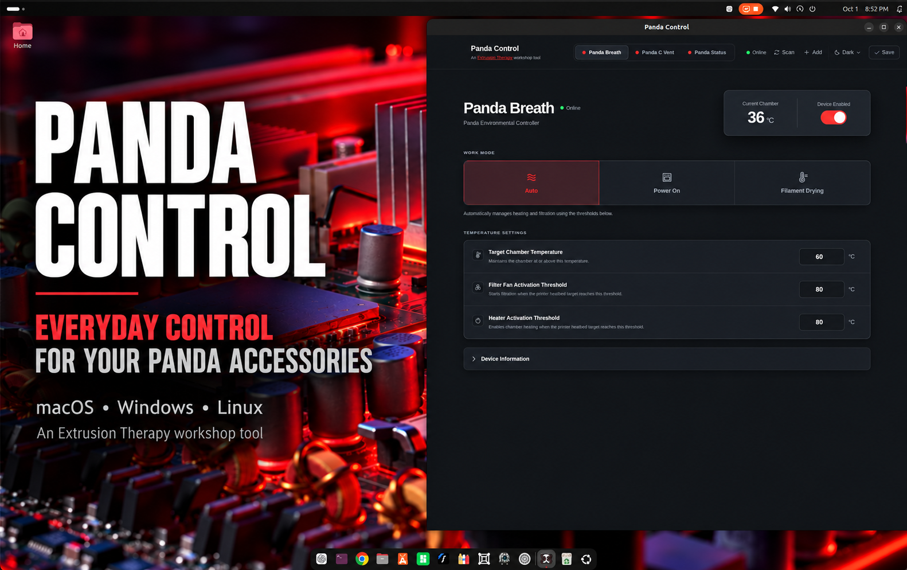

# Panda Control

### One desktop app for everyday control of installed BIQU Panda accessories

Panda Control gives you one desktop interface for managing your supported BIQU Panda devices—without remembering individual IP addresses.

## What it does

- **Panda Status:** Control brightness, music mode, and printer-status colors.
- **Panda Breath:** Control power, operating modes, temperature settings, and filament drying.
- **Panda Vent:** Control lighting, colors, effects, brightness, and printer-follow behavior.
- **Panda Control Vent:** Control vent position, automatic operation, vent lighting, and independent chamber lighting.

All device communication stays on the local network. Panda Control does not require a cloud account.

*Additional Panda devices may be supported as the developer gains access to them.*

## Installation

### macOS

1. Download the [latest Apple-silicon DMG](https://github.com/rdcstout/panda-control/releases/latest/download/Panda-Control-macOS-arm64.dmg). The stable link always points to the current release.
2. Open the DMG and drag **Panda Control** to **Applications**.
3. Launch Panda Control and allow Local Network access when macOS asks.

The macOS build is signed with a Developer ID certificate and notarized by Apple.

### Windows

1. Download the [latest 64-bit Windows installer](https://github.com/rdcstout/panda-control/releases/latest/download/Panda-Control-Windows-x64.exe).
2. Run the installer and launch **Panda Control** from the Start menu.

### Linux

Choose either package for a 64-bit x86 Linux system:

- **AppImage:** Download the [latest AppImage](https://github.com/rdcstout/panda-control/releases/latest/download/Panda-Control-Linux-x86_64.AppImage), mark it executable, and run it.
- **Debian/Ubuntu:** Download the [latest DEB package](https://github.com/rdcstout/panda-control/releases/latest/download/Panda-Control-Linux-amd64.deb) and install it with your normal package installer.

## Using Panda Control

1. Complete the accessory's normal factory setup first so it is already joined to your network and bound to its printer.
2. Open Panda Control and press **Scan**.
3. Select the device tab, adjust its operational settings, and press **Save**.

Scanning is always user-initiated. The app does not rescan the network automatically at startup.

### Updates

Open **About** to check for a new release or change the default weekly update check. Panda Control only checks this repository's public release page; downloading and installing an update always remains your choice.

## Troubleshooting

### No devices are found on macOS

Open **System Settings → Privacy & Security → Local Network** and make sure Panda Control is enabled. Then return to the app and press **Scan**.

### A device moved to a new IP address

Press **Scan**. Version 0.1.2 and later match supported devices by hardware identity and update the saved address instead of adding a duplicate.

### A device is still unavailable

Confirm the Mac and the accessory are on the same local network, verify the accessory is powered on, and try its IP address through **Add**.

## Support future tools

Panda Control is free. If it helps in your shop, you can optionally [support future Extrusion Therapy tools](https://buy.stripe.com/fZu3cw2Mnfr0d7N3ws1kA00). Downloads are never gated behind payment.

## Independent utility

Panda Control is an independent community utility created by Extrusion Therapy. It is not affiliated with or endorsed by BIQU or BIGTREETECH.
